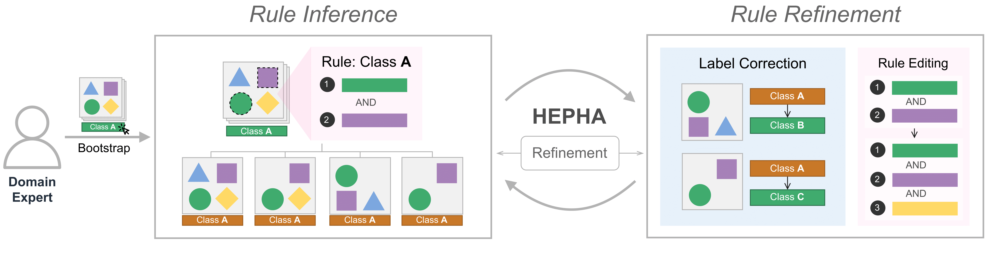

# HEPHA



## 📌 Overview

HEPHA is a mixed-initiative tool that supports image labeling by eliciting labeling knowledge from domain experts.

This project is built with:

- Frontend: ReactJS, Vite
- Backend: ExpressJS, Flask

## 🚀 Setup Instructions

Pre-requisites:

- MongoDB
- Python 3.9
- NodeJS 19
- Tmux (for local setup)

### Local Setup

1. **Clone the repository**

    ```bash
    git clone https://github.com/Neural-Symbolic-Image-Labeling/HEPHA.git
    cd HEPHA
    ```

2. **Install dependencies**  
    This will install all required packages:

    ```bash
    make setup
    ```

3. **Configure environment**  
    Create and modify your environment variables in `.env` file.

4. **Launch the project**  
    The project runs in a tmux session for process management:

    ```bash
    make run
    ```

    To access the tmux session:

    ```bash
    tmux a  # Use Ctrl+B followed by D to detach
    ```

5. **Stop the project**

    ```bash
    make stop
    ```

### Docker Setup

1. **Clone the repository**

    ```bash
    git clone https://github.com/Neural-Symbolic-Image-Labeling/HEPHA.git
    cd HEPHA
    ```

2. **Configure environment**  
    Copy and modify the environment file:

    ```bash
    cp .env.example .env
    ```

3. **Start containers**  
    Launch services in detached mode:

    ```bash
    docker compose up -d --build
    ```

4. **Stop and clean up**

    ```bash
    docker compose down
    ```

## ⚖️ License

This project is licensed under the Apache License 2.0 - see the [LICENSE](LICENSE) for details.

## 📬 Contact

Please email <szhou20@uci.edu> for any questions. Thanks!
